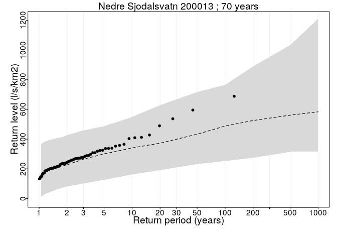

<!-- README.md is generated from README.Rmd. Please edit that file -->

# Bayesian regional flood frequency analysis (FFA)

This tutorial describes the data and analysis considered for Bayesian
hierachical model for Regional flood frequency analysis.

## Installation

First, you need to install the SpatGEVBMA package from NorskRegnesentral
GitHub respository

``` r
# install.packages("devtools")
devtools::install_github("NorskRegnesentral/SpatGEVBMA")
```

Then load the data and functions used for the analysis.

``` r
# Load yearly flood time series and covariates
load("~/BRFFA/data/norwayFlood.Rdata")

# Load functions 
source('~/BRFFA/scripts/functions.R')
```

We start by exploring some descriptive plots of the covariates.
Considering first histograms of the record length, catchment area,
percentage of lake, average rain in April and August and percentage of
flood contributed to rain vs. snowmelt.

``` r

# Define location for map plotting
S <- cbind(covariates$longitude,covariates$latitude)

#Plot histograms for some covariates 
par(mar=c(5,4,1,1),mfrow=c(2,3),cex.axis=1.3,cex.lab=1.5)
hist(rowSums(!is.na(floodData)),xlab='Record length (years)',ylab='Stations',main = '')
hist(log(covariates$area.total),xlab='Catchment area (km²)',ylab='',main = '',xaxt='n')
axis(1,at=log(c(40,10^(2:6))),labels=c(40,10^(2:6)))
hist(covariates$pct.eff.lake,xlab='Lake percentage',ylab='',main = '')
hist(covariates$avg.rain.april,xlab='Average rain April (mm)',ylab='Stations',main = '')
hist(covariates$avg.rain.august,xlab='Average rain August (mm)',ylab='',main = '')
hist(covariates$avg.frac.rain,xlab='Rain contribution (%)',ylab='',main = '')
```

<!-- -->

Now we plot the time series of some selected
stations.

``` r
matplot(1870:2015,t(floodData[c(7,50,80,2,23),])*1000,type='l',lty=1,xlab='Year',ylab = 'Yearly Maximum Flood (l/s/km²')
legend('topleft',lty=1,col=1:5,legend=covariates$station.name[c(7,50,80,2,23)])
```

<!-- -->

Then we plot the percentage of flood contributed to rain vs. snowmelt
according to longitude and latitude of the each considered station, to
reveal the spatial distribution of this covariate.

``` r
#Plot map for some covariates 
library(maps)
all.colors <- colorRampPalette(c("yellow","forestgreen", "blue"))(7) #heat.colors(7)[7:1]
par(mar=c(5,4,1,1),mfrow=c(1,1))
var1 <- covariates$avg.frac.rain
mugr <- rep(NA,length(var1))
gr <- seq(0, 1, length.out=6)
#gr <- c(0,0.1,0.2,0.3,0.5,0.7,1)
for (g in 1:(length(gr)-1)){
  mugr[var1>=gr[g] & var1<gr[g+1]] <- g
}
gr <- 100*gr
ltxt <-  paste0("[",format(gr[-length(gr)]),",",format(gr[-1]),']') # text for legend

par(mar=c(0,0,3,0))  
maps::map("world",regions="Norway",fill=TRUE,col="gray80",ylim=c(58,71),xlim=c(5,30.5),border=FALSE)
title("Rain contribution (%)")
box()
points(S[,1], S[,2], pch=16, col=all.colors[mugr])
legend("bottomright",legend=ltxt,fill=,col=all.colors[1:7],pch=16,cex=1.4)
```

<!-- -->

# Main analysis

The main analysis is carried by running 100 000 MCMC simulation by the
SpatGEV package. The flood data is structured as a list of time series,
one for each station, to allow for difference serie lengths. The
covariates are centered and scaled before analysis.

``` r

###
# set the response variable
####
#datalist <- as.list(as.data.frame(t(floodData/covariates$area_total)))
datalist <- as.list(as.data.frame(t(floodData)))
# remove all NA's from datalist
for (i in 1:length(datalist)) {
  datalist[[i]] <- (datalist[[i]])[!is.na(datalist[[i]])]
}

#Construct matrix of covariates
covMat <- as.matrix(covariates[,2:13])

# Standardize covariates
for (i in 2:dim(covMat)[2]) {
  covMat[,i] <- standardiseVar(covMat[,i])
}

# Add intercept 
covMat <- cbind('Constant' = rep(1,dim(covMat)[1]),covMat)

# Specify prior
prior.user <- NULL
prior.user$eta$beta.0 <- c(log(1000),rep(0,dim(covMat)[2]-1))
```

First, the SpatGEVBMA package is loaded. We run the package with the
options to to non-spationally distributed error, to have the regression
model for the scale parameter on a log scale and to print an output for
every 5000 MCMC run.

In the paper, [Bayesian Regional Flood Frequency Analysis for Large
Catchments](https://agupubs.onlinelibrary.wiley.com/doi/full/10.1029/2017WR022460)
we use 100 000 simulations, but in the following we demonstrate the code
by running 100 simulations.

``` r
library(SpatGEVBMA)
nsim <- 100
res <- spatial.gev.bma(datalist,covMat,S,nsim,prior.user=prior.user,
                       nonspatial = TRUE, log.kappa=TRUE,print.every=5000)
res$cov.names <- colnames(covMat)  
```

The result can be analysed by first removing a suitable range of burn-in
samples, we seletion 20 000 or 20% of the total MCMC runs. The
calculated the inclustion probabilities for each of the covariates
within the location $ () $, scale $ () $, and shape $ () $ parameter of
the GEV distribution.

    #>                     mu kappa  xi
    #> Constant           100   100 100
    #> longitude           19    88  40
    #> latitude            42    89   5
    #> pct.eff.lake       100   100   0
    #> inflow               0     0   0
    #> avg.frac.rain        4    32  50
    #> area.total           0     0   0
    #> avg.rain.april      68    21   0
    #> avg.rain.august     59   100   0
    #> avg.snowmelt.march  16    38   2
    #> gradient            79    16   0
    #> pct.bedrock         60     8   0
    #> relative.area       19   100  11

Then we plot the resulting distribution according to the quantiles or
return values, e.g for 1000 year flood, we calculated the
\(1 - 1/1000 = 0.999\) quantile. The random effects for each MCMC run
are simulated from a Gaussian distribution with the corresponding
variance $ 1/^{(r)} $, separately for each distribution parameter.

``` r
##########################################
###### #Plot return values plots
##########################################

#Selection of station
st.no <- rownames(floodData)[1:2]
T <- c(seq(1.05,1.9,by=0.05),2,3,5,10,20,50,100,200,500,1000)
return.level <- list()
len <- dim(res$THETA[-(1:burn),,])[1] #len=nsim-burn
zp <- matrix(0,nrow=len,ncol=length(T))
p <- 1/T

# Calculated GEV distribution based on MCMC samples
for (i in st.no) {
  mu <- res$THETA[-(1:burn),,1]%*%covMat[i,] + rnorm(len,0,sd = 1/sqrt(res$ALPHA[-(1:burn),1]))
  ka <- res$THETA[-(1:burn),,2]%*%covMat[i,] + rnorm(len,0,sd = 1/sqrt(res$ALPHA[-(1:burn),2]))
  xi <- res$THETA[-(1:burn),,3]%*%covMat[i,] + rnorm(len,0,sd = 1/sqrt(res$ALPHA[-(1:burn),3]))
  if(res$log.kappa) ka <- exp(ka)
  for(j in 1:length(T)) {
    zp[,j] <- returnLevel(mu,ka,xi,T[j],useGumbel=FALSE)
  }
  
  tmplist <- list()
  tmplist$MEAN <- apply(zp,2,median)
  tmplist$lower <- apply(zp,2,quantile,0.1)
  tmplist$upper <- apply(zp,2,quantile,0.9)  
  return.level[[i]] <- tmplist    
}

#Plot return values plots
plotReturnLevel(return.level = return.level,floodData = floodData,
                floodCov = covariates,
                T=T,writeToFile=FALSE,ymin=-0.01,ymax=NULL)
#> [1] "200011" "200013"
```

<!-- --><!-- -->
